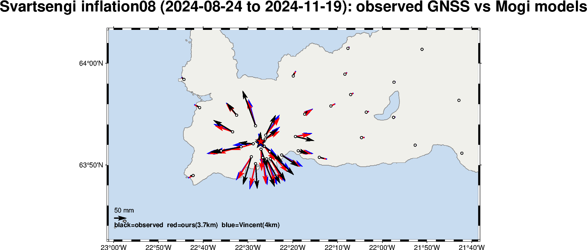

# gps_plot examples

Runnable examples for the PyGMT map lane (`gps_plot.maps`). They need the
`maps` extra (PyGMT) + a GMT ≥ 6 C library; set `GMT_LIBRARY_PATH` for a
from-source GMT build:

```bash
export GMT_LIBRARY_PATH=$HOME/git/gmt/install/lib
uv sync --extra maps            # + `uv pip install -e ~/git/pygmt` on the dev host
```

## `mogi_vector_comparison.py`



Observed GNSS horizontal displacement vs two Mogi point-source models — our
GNSS-only fit (red) and Vincent's operational model (blue) — over the
Svartsengi **inflation08** window (2024-08-24 → 2024-11-19), on a Reykjanes
map. The visual companion to the `gps_api` real-data reconciliation
(Pearson **r = 0.993**). The near-identical red/blue fields despite different
`(depth, ΔV)` show the classic **depth–volume trade-off**; observed (black)
tracks both, diverging only in the near field where a point source is least
valid.

Data = the `gps_api` real-data validation fixture (regenerate with
`gps-api-validate-deformation fetch`); station coords from `gps_parser`,
model predictions from `gps_analysis.mogi_forward`.

```bash
uv run --extra maps python examples/mogi_vector_comparison.py \
    --fixture ~/work/projects/gpslibrary/gps_api/tests/fixtures/realdata \
    --out examples/mogi_vector_comparison.png
```
